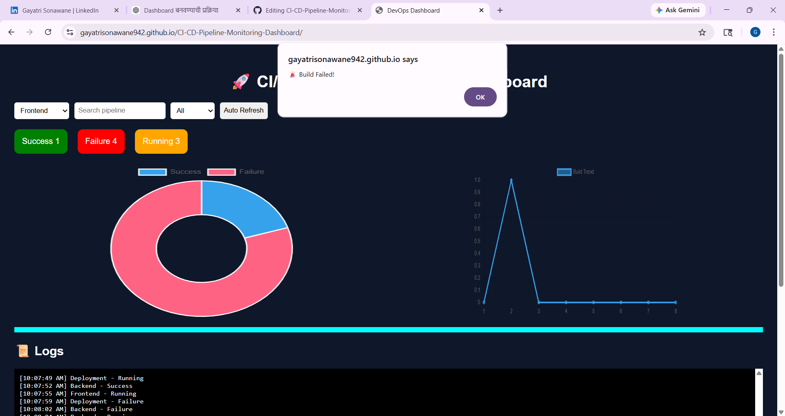

# 🚀 CI/CD Pipeline Monitoring Dashboard

A modern and interactive **DevOps Dashboard** to monitor CI/CD pipelines with real-time simulation, charts, logs, and filtering features.

---

## 🔥 Features

- ✅ Live Build Status (Success / Failure / Running)
- 📊 Interactive Charts (Doughnut + Line)
- 📜 Deployment History Table
- 🔍 Search & Filter Pipelines
- 🧾 Live Logs Viewer
- ⚡ Auto Refresh Simulation
- 🚨 Alert on Failed Builds
- 📈 Progress Bar for Running Builds
- 🌙 Clean Dark UI

---

## 🛠️ Tech Stack

- HTML5
- CSS3
- JavaScript
- Chart.js

---

---

## ▶️ How to Run Locally

1. Download or clone the repository
2. Open the project folder
3. Double click on `index.html`

OR use Live Server in VS Code

---

## 🌐 Live Demo

https://gayatrisonawane942.github.io/CI-CD-Pipeline-Monitoring-Dashboard

---

## 📸 Screenshots

### 🔹 Dashboard Overview

---

## 🚀 Future Enhancements

- Jenkins API Integration (Real CI/CD data)
- Backend (Spring Boot / Node.js)
- Docker containerization
- Kubernetes deployment
- AWS hosting
- Authentication system

---

## 💡 Use Case

This project demonstrates **DevOps monitoring concepts** and can be used as a portfolio project for roles like:
- DevOps Engineer
- Cloud Engineer
- Software Engineer

---

## 👩‍💻 Author

**Gayatri Sonawane**

---

## ⭐ Support

If you like this project, give it a ⭐ on GitHub!

